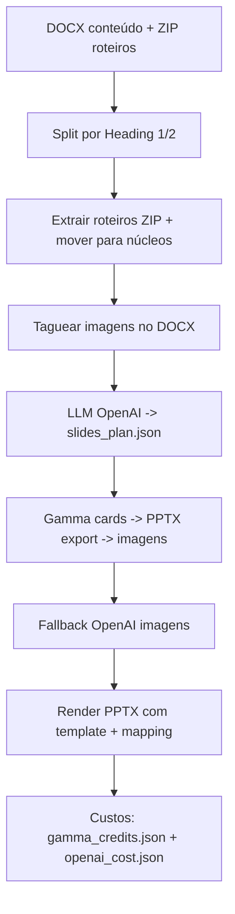

# criador_aulas — README Técnico do Pipeline

Este documento descreve o **pipeline técnico atual** do repositório, tratando o
sistema como produção. O objetivo é explicitar **ordem de execução**, **entradas**,
**saídas**, **classificação** e **custos** (financeiro, tempo, tokens).

---

## Visão geral

Pipeline end-to-end:
1) organiza conteúdo e roteiros (DOCX + ZIP)  
2) prepara conteúdo (tag de imagens)  
3) gera plano via LLM (JSON)  
4) gera imagens (Gamma com fallback OpenAI)  
5) renderiza PPTX a partir de template  
6) grava métricas de custo

Entrada principal: `python .\app.py --curso-dir <curso>`

Seleção do provider de imagens:

```bash
python .\app.py --curso-dir <curso> --image-provider gamma
python .\app.py --curso-dir <curso> --image-provider openai
```

---

## Resumo executivo (enxuto)

- Pipeline transforma DOCX + ZIP de roteiros em PPTX final por núcleo.
- Etapas críticas: split por Heading, planejamento LLM, geração de imagens via Gamma (fallback OpenAI) e render PPTX.
- Custos financeiros concentrados em **LLM** (tokens) e **Gamma/OpenAI imagens**.
- Acoplamentos principais: estilos do DOCX e template PPTX com mapping de placeholders.

---

## Diagrama textual do fluxo

```
DOCX (conteúdo) + ZIP (roteiros)
        |
        v
[1] Split DOCX por Heading 1/2 -> modX_n{c|p}Y + mod0_vidint
        |
        v
[2] Extrair roteiros do ZIP -> roteiros/ -> mover para cada núcleo
        |
        v
[3] Taguear imagens no DOCX do núcleo -> assets/<nucleo>/img_*.ext + _tagged.docx
        |
        v
[4] LLM (OpenAI) -> slides_plan.json
        |
        v
[5] Gamma (cards -> PPTX export) -> extrair imagens -> assets/<nucleo>/gen_*.png
        |
        v
[6] Fallback OpenAI imagem (se necessário) -> assets/<nucleo>/gen_*.png
        |
        v
[7] Render PPTX (template + mapping) -> <nucleo>.pptx
        |
        v
[8] Custos -> gamma_credits.json + openai_cost.json
```

---

## Diagrama Mermaid



---

## Etapas do pipeline (ordem, entradas/saídas, classificação, custos)

### 0) Orquestração global
**Tipo:** ORQUESTRAÇÃO  
**Onde:** `app.py`  
**Entradas:** `--curso-dir`, `--template`, `--only`, `--force`, `--reuse-assets`, `--image-provider`  
**Saídas:** execução sequencial/concorrente das etapas; escrita de `gamma_credits.json` e `openai_cost.json`.  
**Custos:**  
- Tempo: **alto** (coordena IO, rede, render)  
- Financeiro: indireto (aciona etapas com custo)  
- Tokens: indireto (aciona LLM)

---

### 1) Split de conteúdo por Heading (módulo e núcleo)
**Tipo:** LÓGICA  
**Onde:** `app/content_splitter.py`  
**Entradas:**
- DOCX na raiz do curso (não `ROT_*`), estilos `Heading 1` (módulo) e `Heading 2` (núcleo)  
- `--force`  
**Saídas:**
- Pastas `modX_n{c|p}Y/` com `modX_n{c|p}Y.docx`  
- `mod0_vidint/` com `mod0_vidint.docx` (conteúdo completo)  
- Remove cabeçalho/rodapé antes de salvar  
**Custos:**  
- Tempo: **médio** (IO e parsing DOCX)  
- Financeiro: **não**  
- Tokens: **não**

---

### 2) Extração e distribuição de roteiros (ZIP)
**Tipo:** LÓGICA  
**Onde:** `app/roteiro_zip.py`  
**Entradas:**
- ZIPs na raiz do curso  
- Regex `ROTEIRO_PATTERN` (`app/config/pipeline.py`)  
**Saídas:**
- `roteiros/` com `.docx` extraídos  
- Move cada `ROT_*` para o núcleo correspondente  
**Custos:**  
- Tempo: **baixo/médio** (IO)  
- Financeiro: **não**  
- Tokens: **não**

---

### 3) Tag de imagens no DOCX (conteúdo)
**Tipo:** LÓGICA  
**Onde:** `app/docx_tagger.py`  
**Entradas:**
- `modX_nY.docx` (conteúdo do núcleo)  
- Pasta `assets/<nucleo>/`  
**Saídas:**
- `modX_nY_tagged.docx`  
- Extração de imagens para `assets/<nucleo>/img_XXXX.ext`  
- Substituição das imagens por tags `[[IMG:assets/<nucleo>/img_XXXX.ext]]`  
**Custos:**  
- Tempo: **médio** (IO + parsing XML)  
- Financeiro: **não**  
- Tokens: **não**

---

### 4) Planejamento do plano de slides (LLM)
**Tipo:** IA (LLM)  
**Onde:** `app/gpt_planner.py`  
**Entradas:**
- `modX_nY_tagged.docx`  
- `ROT_*.docx`  
- `app/prompts/prompt_gpt.md`  
- `DEFAULT_MODEL`  
**Saídas:**
- `slides_plan.json` (contrato JSON do plano)  
- Métrica de tokens (usage) para custo  
**Custos:**  
- Tempo: **alto** (rede + processamento)  
- Financeiro: **SIM** (OpenAI LLM)  
- Tokens: **SIM** (prompt + completion)

---

### 5) Geração de imagens via Gamma (cards -> PPTX -> imagens)
**Tipo:** IA (geração)  
**Onde:** `app/gamma/*`  
**Entradas:**
- `slides_plan.json` (somente slides `image.source="generated"`)  
- `app/config/gamma_config.json` (api_key, cookie, payload)  
**Processo:**
- Concatena cards (somente slides com `image.source="generated"`)  
- Prefixa o conteúdo de `app/prompts/gamma.md` ao prompt (rota from-template não aceita campo `instruction`)  
- POST `.../generations/from-template` com `gammaId`, `folderIds` e `exportAs: pptx`  
- Polling até `status=completed` e `exportUrl`  
- Download do PPTX e extração da maior imagem por slide  
**Saídas:**
- `assets/<nucleo>/gamma_export.pptx`  
- `assets/<nucleo>/gen_<slide_id>.<ext>`  
- Atualiza `slides_plan.json` com `image.path`  
**Custos:**  
- Tempo: **alto** (rede + polling + download + parsing PPTX)  
- Financeiro: **SIM** (créditos Gamma)  
- Tokens: **não**

---

### 6) Fallback OpenAI imagens (se Gamma não cobrir tudo)
**Tipo:** IA (geração)  
**Onde:** `app/image_generator.py`  
**Entradas:**
- `slides_plan.json` (slides `source=generated` sem `image.path`)  
- `OPENAI_API_KEY`  
**Saídas:**
- `assets/<nucleo>/gen_<slide_id>.png`  
- Atualiza `slides_plan.json` com `image.path`  
**Custos:**  
- Tempo: **alto** (rede + geração)  
- Financeiro: **SIM** (OpenAI imagens)  
- Tokens: **não** (cobrança por imagem, não por tokens)

---

### 7) Renderização PPTX final (template + mapping)
**Tipo:** LÓGICA  
**Onde:** `app/pptx_renderer.py`, `app/template_mapping.py`, `app/slide/*`  
**Entradas:**
- `slides_plan.json`  
- `template_ppt_graduacao.pptx`  
- `template_ppt_graduacao_map.json` (mapping de placeholders)  
- `assets/`  
**Saídas:**
- `<nucleo>/<nucleo>.pptx`  
- Remove slides-sentinela do template antes de inserir novos slides  
**Custos:**  
- Tempo: **médio** (IO + render PPTX)  
- Financeiro: **não**  
- Tokens: **não**

---

### 8) Métricas de custo (Gamma + OpenAI)
**Tipo:** ORQUESTRAÇÃO / LÓGICA  
**Onde:** `app.py`, `app/openai_cost.py`  
**Entradas:**
- Uso de tokens LLM (OpenAI)  
- Contagem de imagens e preço por tamanho  
- Créditos deduzidos do Gamma  
**Saídas:**
- `gamma_credits.json` (total e por núcleo, com custo em R$)  
- `openai_cost.json` (total e por núcleo)  
**Custos:**  
- Tempo: **baixo**  
- Financeiro: **não** (apenas cálculo)  
- Tokens: **não**

---

## Observações de risco e acoplamento

- **Template PPTX** é altamente acoplado ao mapping (`*_map.json`) e aos nomes de placeholders.
  Troca de template exige regenerar mapping e validar placeholders esperados.
- **Dependência de estilos DOCX** (`Heading 1/2`): sem estilos corretos, o split falha ou cria núcleos errados.
- **Gamma API** depende de `api_key` e `cookie` válidos; o pipeline falha se expirarem.
- **OpenAI** depende de `OPENAI_API_KEY` e do contrato do prompt (`app/prompts/prompt_gpt.md`).
- **Ordem dos slides**: o mapeamento de imagens Gamma assume ordem igual entre cards e slides exportados.
- **Custos**: Gamma deduz créditos por geração; OpenAI cobra por tokens (LLM) e por imagem (fallback).

---

## Arquivos de configuração relevantes

- `app/config/paths.py` — paths base  
- `app/config/pipeline.py` — defaults, workers e regex  
- `app/config/gamma_config.json` — credenciais e payload Gamma (não versionar)  
- `app/config/openai_pricing.json` — preços para cálculo de custo  
- `app/prompts/prompt_gpt.md` — contrato do LLM (não editar sem alinhamento)
